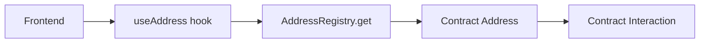

# 🔥 Rot Ritual - Web3 Gaming Ecosystem

> **Complete chain-first sacrifice & cosmetics system with zero address drift**

A decentralized gaming platform featuring NFT sacrifices, cosmetic rewards, and a fully on-chain address resolution system.

## 🏗️ Architecture

### Monorepo Structure
```
rot-ritual-web/
├── apps/
│   └── web/                 # React frontend (Vite + wagmi)
└── packages/
    └── contracts/           # Smart contracts (Hardhat + Foundry)
```

### 🔗 Chain-First Address Resolution
**Zero hardcoded addresses in frontend** - All contract addresses resolved from on-chain AddressRegistry.

```typescript
// ✅ Chain-first (current)
const address = useAddress('COSMETICS'); // → AddressRegistry.get()

// ❌ Hardcoded (eliminated)
const address = '0x123...'; // → Causes address drift
```

**System Status: 9/9 contracts chain-first (100%)**

## 🚀 Quick Start

### Prerequisites
- Node.js 18+
- npm/yarn/pnpm

### Installation
```bash
# Clone and install
git clone <repo>
cd rot-ritual-web
npm install

# Start development
npm run dev:web        # Frontend on :5173
npm run dev:contracts  # Contract compilation
```

### Environment Setup
```bash
# Copy environment template
cp .env.example .env

# Add your configuration
VITE_WALLET_CONNECT_PROJECT_ID=your_project_id
PRIVATE_KEY=your_private_key_for_deployments
```

## 📋 Contract Ecosystem

| Contract | Address | Purpose |
|----------|---------|---------|
| **AddressRegistry** | `0xF7FC...D7db` | **Single source of truth for all addresses** |
| Relics (ERC1155) | Registry → `RELICS` | Core sacrifice tokens |
| MAW Sacrifice | Registry → `MAW_SACRIFICE` | Sacrifice mechanics |
| Cosmetics V2 | Registry → `COSMETICS` | Seasonal cosmetic catalog |
| Demons (ERC721) | Registry → `DEMONS` | Demon NFTs |
| Cultists (ERC721) | Registry → `CULTISTS` | Cultist NFTs |
| Key Shop | Registry → `KEY_SHOP` | Key purchasing |
| Raccoons (ERC721) | Registry → `RACCOONS` | Raccoon NFTs |
| Raccoon Renderer | Registry → `RACCOON_RENDERER` | Raccoon metadata |
| Read Aggregator | Registry → `RITUAL_READ_AGGREGATOR` | Batch reading |

### 🛡️ Address Drift Protection
- **Frontend**: All `useAddress()` calls resolve from AddressRegistry
- **Scripts**: Chain-first pattern prevents hardcoding
- **CI**: Pre-commit hooks scan for hardcoded addresses

## 🎮 Key Features

### Sacrifice System
- **Rusted Caps** → Glass Shards or Relics (relic pool)
- **Lantern Fragments** → Cosmetics or Glass Shards (cosmetic pool)
- **Real-time reward detection** via event parsing
- **Chain-first transaction handling** with proper confirmations

### Cosmetics System
- **CosmeticsV2**: Seasonal catalog management
- **Monthly rotation**: `setCurrentCosmeticTypes()`
- **IPFS metadata**: Decentralized asset storage
- **Chain-first resolution**: Zero hardcoded cosmetic addresses

### Address Resolution
```typescript
// Universal hook for any contract
export function useAddress(contractKey: ContractKey) {
  return useReadContract({
    address: ADDRESS_REGISTRY,
    functionName: 'get',
    args: [keccak256(toUtf8Bytes(contractKey))]
  });
}
```

## 🛠️ Development

### Available Scripts
```bash
# Frontend
npm run dev:web              # Development server
npm run build:web            # Production build
npm run preview:web          # Preview build

# Contracts
npm run compile              # Compile contracts
npm run test                 # Run tests
npm run deploy:sepolia       # Deploy to Base Sepolia
npm run verify              # Verify contracts

# System Health
npm run check:contract-health    # Verify all contracts
npm run check:frontend-integrity # Check address consistency
```

### Testing
```bash
# Contract tests
cd packages/contracts
npx hardhat test

# Frontend tests  
cd apps/web
npm run test
```

## 📖 Development Guides

### Adding New Contracts
1. Deploy contract
2. Add to AddressRegistry via `setAll()`
3. Add contract key to `useAddress.ts`
4. Update frontend to use `useAddress('NEW_CONTRACT')`

### Updating Cosmetics
```bash
# Update seasonal cosmetics
npx hardhat run scripts/setup-seasonal-cosmetics.cjs --network baseSepolia

# Verify system health
npx hardhat run scripts/verify-system-health.cjs --network baseSepolia
```

### Address Resolution Flow


## 🔒 Security

### Best Practices
- ✅ All addresses resolved from chain (no hardcoding)
- ✅ Private keys in environment variables only
- ✅ Pre-commit hooks prevent address leaks
- ✅ Comprehensive .gitignore for secrets
- ✅ Role-based contract access control

### Never Commit
- Private keys
- Mnemonic phrases  
- `.env` files with secrets
- Hardcoded contract addresses

## 🌐 Networks

### Base Sepolia (Current)
- **RPC**: `https://sepolia.base.org`
- **Chain ID**: 84532
- **AddressRegistry**: `0xF7FC9caa60f4D12d731B32883498A8D403b9c828`

## 📊 System Health

Current status can be checked via:
- **Frontend**: AddressSystemDemo component
- **Scripts**: `scripts/verify-system-health.cjs`
- **CI**: Automated health checks

## 🤝 Contributing

1. Fork the repository
2. Create feature branch
3. Follow existing patterns (especially chain-first)
4. Test thoroughly
5. Submit pull request

### Code Style
- 2 spaces for indentation
- Chain-first address resolution
- Comprehensive error handling
- Event-based reward detection

## 📄 License

MIT License - See LICENSE file for details

---

**🎯 Zero Address Drift Achieved: All 9 contracts use chain-first resolution**